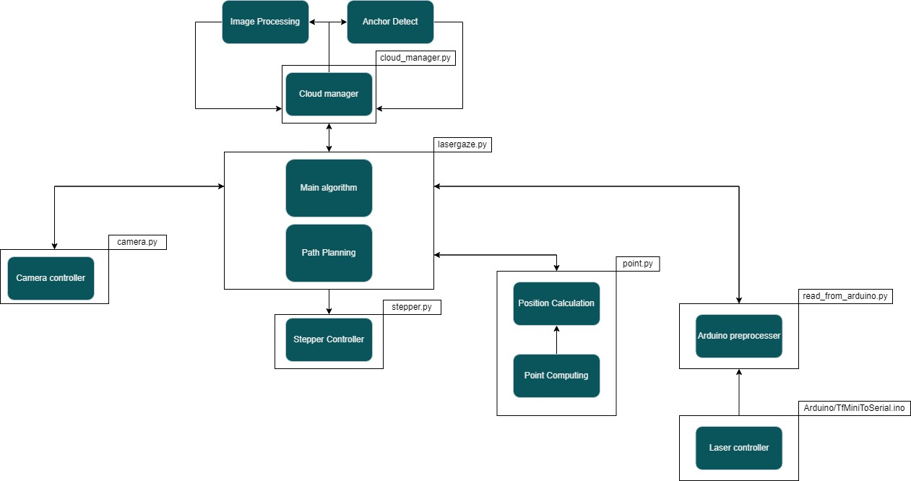

# LaserGaze
## Automatic 3D Space mapping from laser scanning and computer vision based tethering
LaserGaze is a robot capable to map and scan interiors easily and return this mapping as a file that can be analyzed and modified as the user sees fit.

And as an interior scanner, its uses range from giving relevant data to insurance companies about a house room by room, to helping find possible architectural weak points on weathered down buildings, or even easing in the creation of 3D models of interiors by letting designers use real examples as base model on which to expand upon.

The robot uses its mounted camera and laser sensor to measure the distances to one point of the room, and upon completion, to continue mapping, its two stepper motors will rotate the sensors without changing their relative position to the room to allow a new measure to take place.

In addition, if the room that the user wants to scan has a complex shape or has enough small objects on it, one spot might not be enough to correctly map its whole interior, in response to this, the robot will have the capacity to be moved to another spot and begin a new scan, adding it to the initial one and complementing it. This however will require the use of visual tethers, which will help the robot find its new position on the room and therefor allowing an easy way to merge the newer measures to the original ones.

The tethers are two balls with different and recognizable patterns, which will be recognized by using computer vision, and the photos made to find them will be used to create a point cloud representative of the 3D mapping of the room.

## Table of Contents
   * [What is this?](#what-is-this)
   * [Requirements](#requirements)
   * [Components](#components)
   * [Hardware Scheme](#hardware-scheme)
   * [Software Architecture](#software-architecture)
   * [Amazing Contributions](#amazing-contributions)
   * [Licence](#licence)
   * [Authors](#authors)

## What is this?

This is the main repository regarding the creation, implementation and usage of a 3D room scanning robot.

Features:

1. Listing of the components needed to build the physical robot.

2. Python code commented to grant an easier undestanding of its functionality.

## Requirements

Python modules needed in order to run the code:

- [Python 3.9.x](https://www.python.org/)
- [picamera](https://picamera.readthedocs.io/en/release-1.13)
- [picamera.array](https://picamera.readthedocs.io/en/release-1.13/api_array.html)
- [cv2](https://docs.opencv.org/4.x/d6/d00/tutorial_py_root.html)
- [time](https://docs.python.org/3/library/time.html)
- [urllib.parse](https://docs.python.org/3/library/urllib.parse.html)
- [requests](https://www.w3schools.com/python/module_requests.asp)
- [RPi.GPIO](https://pythonhosted.org/RPIO/)
- [math](https://docs.python.org/3/library/math.html)
- [serial](https://pyserial.readthedocs.io/en/latest/pyserial.html)
- [google.cloud](https://cloud.google.com/python/docs/reference)

## Components

List of the components used in the project:

- [Raspberry Pi 3 B+](https://diotronic.com/placas-rasberry-pi-y-kits/16824-raspberry-pi-3-b)
- [Camera](https://diotronic.com/camaras-para-raspberry/15615-camara-5mp-ov5647-rpi)
- [Laser](https://es.farnell.com/dfrobot/sen0259/sensor-telemetr-a-l-ser-lidar/dp/3769959?gclid=CjwKCAiAgvKQBhBbEiwAaPQw3Ibionnl9WSb1O353YiEfcBXAHsigqAMlhVlRdxYx2NFA3Odc8eCcRoCOTUQAvD_BwE&mckv=sl5ZVvWEa_dc%7Cpcrid%7C491017246493%7Cplid%7C%7Ckword%7C%7Cmatch%7C%7Cslid%7C%7Cproduct%7C3769959%7Cpgrid%7C116132254277%7Cptaid%7Cpla-299786031742&CMP=KNC-GES-GEN-SHOPPING-SMEC-Whoops-Medium-Desktop-Title-Changes-10-Aug-21&gross_price=true)
- [Stepper motor with driver x2](https://diotronic.com/motores-paso-a-paso/15218-motor-paso-a-paso-con-driver)
- [Arduino Nano](https://es.farnell.com/arduino/a000005/arduino-nano-placa-de-evaluaci/dp/1848691)
- [Power Bank](https://diotronic.com/powerbanks/17660-power-bank-5000-mah-1x-usb-a)
- [Battery Holder](https://diotronic.com/portapilas/7012-portapilas-4-pilas-r6-aa-clip)
- [AA 1.5V Battery x4](https://www.amazon.es/Alcalinas-Bater%C3%ADas-Linternas-Distancia-Juguetes-20/dp/B09D3MZ487/ref=sr_1_1_sspa?keywords=rechargeable%2Baa%2Bbatteries&qid=1653566690&sr=8-1-spons&spLa=ZW5jcnlwdGVkUXVhbGlmaWVyPUEyNjhaTFJGVFFTNDZXJmVuY3J5cHRlZElkPUEwOTIyNzk2MUhSR0FURjhRMTQ3TCZlbmNyeXB0ZWRBZElkPUEwNDU4MzkxM0k3WlE0NlRVM1NXNyZ3aWRnZXROYW1lPXNwX2F0ZiZhY3Rpb249Y2xpY2tSZWRpcmVjdCZkb05vdExvZ0NsaWNrPXRydWU&th=1)
- [Limit Switch x2](https://diotronic.com/microrruptores-final-de-carrera/12328-microrruptor-c-palanca-gancho)

## Hardware Scheme

The following scheme details the connections between all components:

## Software Architecture

### Cloud functions:
#### Image Processing.
Is called by the cloud manager, and proceeds to grab a specific image from the cloud storage and process it to return interest points.
#### Anchor detect.
Is called by the cloud manager, and proceeds to grab a specific image from the cloud storage and look for points to anchor itself.
### cloud_manager.py:
#### Cloud manager.
Is called by the main algorithm to upload and regulate images in the cloud.
### lasergaze.py:
#### Main Algorithm.
Decides on which actions to take based on the inputs of the other modules.
#### Path Planning.
Sends to the Stepper Controller module the angles to get to the position the Main Algorithm dictates.
### camera.py:
#### Camera controller.
Controls the camera, returns a picture when called.
### stepper.py:
#### Stepper Controller.
Regulates the steps each motor makes as well as the equivalent in degrees.
### point.py:
#### Point computing.
Set of trigonometry utilities that calculate points from steps and distance measures.
#### Position Calculation.
Calculates the absolute position of the robot from its relative position to the anchors.
### read_from_arduino.py:
#### Arduino preprocessor.
Receives data from the Arduino-connected laser and sends it to the main Algorithm when requested.
### Arduino/TfMiniToSerial.ino:
#### Laser controller.
Laser Arduino code that allows for cyclic measurement.

## Amazing Contributions
- Cost: The cheapest automatic 3d scanner not object focused we could find was well over the 1.000€ and offering a low-cost variant for amateur and personal use could introduce many enthusiasts into the field.
- Software: The current state of the art in 3d mapping is completely focused on brute forcing, getting absurd amounts of points for high resolution, laser-gaze tackles said problem by processing images that allow for focused point taking, which gets an upgraded resolution with the cheapest end of the hardware pieces.
- Evolution: The whole scale of this project allows for amateur delving specially the software aspect can be worked with for an increasingly evolving product.
- Adaptability: Specially the hardware part of this project allows for varying substitutes, which would likely result in a greater quality at an increasing cost in both money and time investment.

## Licence

## Authors

-Sergi Bons Fuses 

-Guillem Centelles Pavon

-David Méndez Ribera

-Gerard Sánchez Sivill
